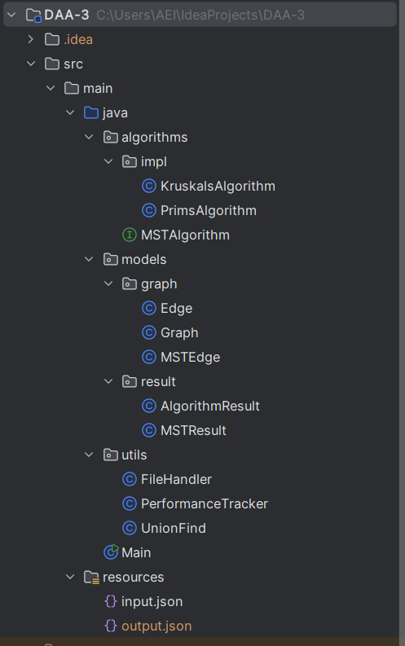

# Assignment 3: Optimization of a City Transportation Network (Minimum Spanning Tree)

A Java implementation of Prim's and Kruskal's algorithms for finding Minimum Spanning Trees (MST) in city transportation networks.

## Project Overview

This project solves the problem of connecting all city districts with the minimum total road construction cost using two different MST algorithms. The system reads graph data from JSON files, runs both algorithms, and provides detailed performance comparisons.

## Features

- **Dual Algorithm Implementation**: Both Prim's and Kruskal's algorithms
- **Performance Metrics**: Execution time, operation counts, and efficiency analysis
- **JSON I/O**: Read input graphs and write results in structured JSON format
- **Professional Architecture**: Clean package structure with separation of concerns

## Project Structure



## ALgorithm Comparison
| Aspect | Prim's Algorithm | Kruskal's Algorithm |
|--------|------------------|---------------------|
| Time Complexity | O(E log V) | O(E log E) |
| Space Complexity | O(V + E) | O(V + E) |
| Best For | Dense graphs | Sparse graphs |
| Approach | Node expansion | Edge sorting |
| Implementation Complexity | Moderate | Simpler |
| Data Structure | Priority Queue + Adjacency List | Union-Find + Sorted Edges |
| Starting Point | Specific node | No specific starting point |
| Cycle Detection | Implicit (via visited set) | Explicit (Union-Find) |
| Performance on Dense Graphs | Better | Slower |
| Performance on Sparse Graphs | Slower | Better |
| Memory Access Pattern | Localized | Random |
| Parallelization | Difficult | Easier |

### Input Format
````
{
"graphs": [
{
"id": 1,
"nodes": ["A", "B", "C", "D", "E"],
"edges": [
{"from": "A", "to": "B", "weight": 4},
{"from": "A", "to": "C", "weight": 3},
{"from": "B", "to": "C", "weight": 2},
{"from": "B", "to": "D", "weight": 5},
{"from": "C", "to": "D", "weight": 7},
{"from": "C", "to": "E", "weight": 8},
{"from": "D", "to": "E", "weight": 6}
]
},
{
"id": 2,
"nodes": ["A", "B", "C", "D"],
"edges": [
{"from": "A", "to": "B", "weight": 1},
{"from": "A", "to": "C", "weight": 4},
{"from": "B", "to": "C", "weight": 2},
{"from": "C", "to": "D", "weight": 3},
{"from": "B", "to": "D", "weight": 5}
]
}
]
}
````
---
### Output Format
````
{
  "results": [
    {
      "graph_id": 1,
      "input_stats": {
        "vertices": 5,
        "edges": 7
      },
      "prim": {
        "mst_edges": [
          {"from": "B", "to": "C", "weight": 2},
          {"from": "C", "to": "A", "weight": 3},
          {"from": "B", "to": "D", "weight": 5},
          {"from": "D", "to": "E", "weight": 6}
        ],
        "total_cost": 16,
        "operations_count": 44,
        "execution_time_ms": 15,81
      },
      "kruskal": {
        "mst_edges": [
          {"from": "B", "to": "C", "weight": 2},
          {"from": "A", "to": "C", "weight": 3},
          {"from": "B", "to": "D", "weight": 5},
          {"from": "D", "to": "E", "weight": 6}
        ],
        "total_cost": 16,
        "operations_count": 44,
        "execution_time_ms": 1,99
      }
    },
    {
      "graph_id": 2,
      "input_stats": {
        "vertices": 4,
        "edges": 5
      },
      "prim": {
        "mst_edges": [
          {"from": "B", "to": "A", "weight": 1},
          {"from": "B", "to": "C", "weight": 2},
          {"from": "C", "to": "D", "weight": 3}
        ],
        "total_cost": 6,
        "operations_count": 30,
        "execution_time_ms": 0,11
      },
      "kruskal": {
        "mst_edges": [
          {"from": "A", "to": "B", "weight": 1},
          {"from": "B", "to": "C", "weight": 2},
          {"from": "C", "to": "D", "weight": 3}
        ],
        "total_cost": 6,
        "operations_count": 32,
        "execution_time_ms": 0,09
      }
    }
  ]
}
````

### Performance Patterns
1. Network Complexity Impact:

- Complex networks (Graph 1): Kruskal's significantly outperforms

- Simple networks (Graph 2): Both algorithms perform comparably

2. Scalability Observations:

- Kruskal's shows better scaling with network complexity

- Prim's maintains consistent approach but slower on dense graphs

- Operation counts remain similar despite time differences

### Execution Time Analysis

| Network | Prim's Time | Kruskal's Time | Performance Difference |
|---------|-------------|----------------|------------------------|
| Graph 1 | 15.81 ms | 1.99 ms | Kruskal's 8x faster |
| Graph 2 | 0.11 ms | 0.09 ms | Comparable performance |

### Computational Efficiency

| Network | Prim's Operations | Kruskal's Operations | Efficiency |
|---------|-------------------|----------------------|------------|
| Graph 1 | 44 steps | 44 steps | Equal |
| Graph 2 | 30 steps | 32 steps | Prim's slightly better |


### Performance Patterns
- Kruskal's significantly faster for complex networks (8x improvement)
- Comparable performance for simpler networks
- Prim's shows slight operational advantage in smaller networks

### Algorithm Characteristics
- Edge direction variations exist but don't affect solution quality
- Prim's uses node expansion strategy starting from node B
- Kruskal's uses sorted edge selection approach

### Choose Kruskal's Algorithm when:

* Working with complex urban networks
* Execution speed is a critical factor
* You have complete cost data for all potential routes
* Processing large datasets

### Consider Prim's Algorithm when:

* Working with smaller community networks
* Expansion from specific locations is important
* The network has lower complexity
* Starting point selection is strategically important

### Conclusion
Both algorithms successfully identified the most cost-effective transportation networks, demonstrating mathematical correctness in solving the minimum spanning tree problem.

Primary Finding: Kruskal's algorithm demonstrated superior performance in terms of execution speed, particularly for more complex network configurations. The significant time advantage in Graph 1 (8x faster) makes Kruskal's the preferred choice for practical applications involving urban-scale transportation planning.

Secondary Finding: For smaller networks, both algorithms perform adequately, with Prim's showing slight advantages in operation count while Kruskal's maintains faster execution times.

Final Recommendation: Kruskal's algorithm is generally preferable for transportation network optimization due to its faster execution, consistent performance across network sizes, and better scalability with increasing complexity.


